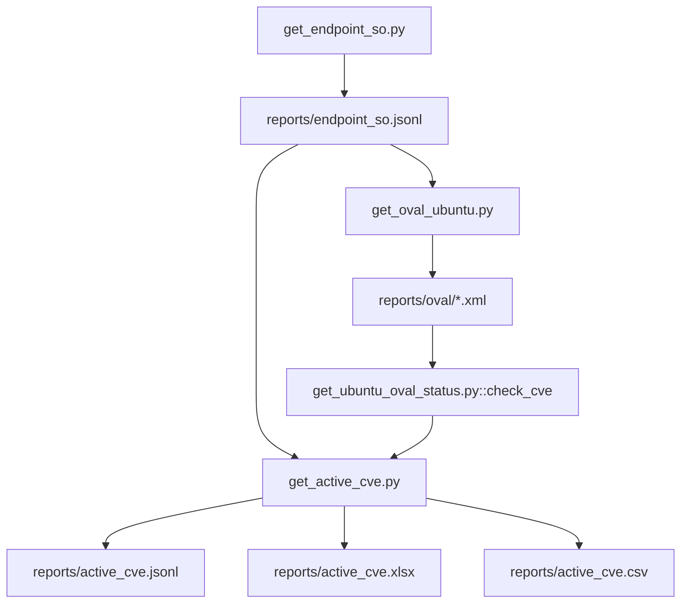

# `active_vulnerabilities` — operação técnica

Documentação operacional dos scripts que sustentam `get_active_cve.py`: dependências externas, ordem de execução, parâmetros, artefatos gerados e leiaute.

## Objetivo do `get_active_cve.py`

`get_active_cve.py` é o script de entrega final. Ele consulta CVEs ativas no Vicarius, filtra para endpoints Ubuntu, enriquece status de correção via OVAL/Ubuntu Security API e gera arquivos analíticos (`.xlsx`, `.csv`, `.jsonl`).

Referência detalhada por script: [`get_active_cve.md`](./get_active_cve.md)

## Dependências externas (rede)

| Fonte externa | Endpoint/base | Consumida por | Finalidade |
| --- | --- | --- | --- |
| Vicarius API | `/vicarius-external-data-api/endpoint/search` | `get_endpoint_so.py` | Mapear `endpointId` -> `endpointName` |
| Vicarius API | `/vicarius-external-data-api/organizationEndpointPublisherOperatingSystems/search` | `get_endpoint_so.py` | Obter SO e versão por endpoint |
| Vicarius API | `/vicarius-external-data-api/aggregation/searchGroup` | `get_active_cve.py` | Coletar vulnerabilidades ativas |
| Canonical OVAL | `https://security-metadata.canonical.com/oval/` | `get_oval_ubuntu.py` | Baixar feeds `usn` e `cve` por release Ubuntu |
| Ubuntu Security API | `https://ubuntu.com/security/cves/{CVE}.json` | `get_ubuntu_oval_status.py` (fallback) | Resolver status quando CVE não está no OVAL local |

## Ordem de execução e quando reexecutar

| Ordem | Script | Quando executar novamente |
| --- | --- | --- |
| 1 | `get_endpoint_so.py` | Sempre que houver mudança de inventário/endpoints ou SO/version |
| 2 | `get_oval_ubuntu.py` | No dia da coleta (ou quando atualizar base OVAL Ubuntu) |
| 3 | `get_active_cve.py` | Sempre que precisar atualizar relatório de vulnerabilidades |

`get_ubuntu_oval_status.py` não entra no fluxo manual padrão; ele é chamado internamente por `get_active_cve.py`.

## Parâmetros de execução (CLI)

### `get_endpoint_so.py`

| Parâmetro | Tipo | Default | Função |
| --- | --- | --- | --- |
| `--env` | caminho | `.env` | Arquivo de credenciais (relativo ao diretório do script) |
| `--output` | caminho | `reports/endpoint_so.jsonl` | Arquivo JSONL de saída endpoint/SO |

### `get_oval_ubuntu.py`

| Parâmetro | Tipo | Default | Função |
| --- | --- | --- | --- |
| `--input` | caminho | `reports/endpoint_so.jsonl` | JSONL de entrada para detectar versões Ubuntu |
| `--output-dir` | caminho | `reports/oval` | Diretório de saída dos arquivos `.bz2` e `.xml` |

### `get_active_cve.py`

| Parâmetro | Tipo | Default | Função |
| --- | --- | --- | --- |
| `--force-update` | flag | `false` | Força nova coleta e ignora reutilização interativa de arquivos locais |

### `get_ubuntu_oval_status.py` (uso técnico/teste)

| Parâmetro | Tipo | Obrigatório | Função |
| --- | --- | --- | --- |
| `--ubuntu` | texto | sim | Versão Ubuntu (ex.: `22.04`) |
| `--cve` | texto | sim | CVE alvo (ex.: `CVE-2016-4956`) |
| `--pkg` | repetível `nome:versão` | sim | Pacote(s) e versão(ões) instaladas |

## Variáveis de ambiente relevantes

| Variável | Script | Default | Observação |
| --- | --- | --- | --- |
| `VICARIUS_BASE_URL` | `get_endpoint_so.py`, `get_active_cve.py` | — | obrigatória |
| `VICARIUS_API_KEY` | `get_endpoint_so.py`, `get_active_cve.py` | — | obrigatória |
| `VRX_REQUEST_DELAY` | `get_endpoint_so.py` | `1.05` | espaçamento entre requests |
| `VRX_MAX_RETRIES` | `get_endpoint_so.py` | `6` | retries HTTP/network |
| `VRX_BACKOFF_BASE` | `get_endpoint_so.py` | `2` | base do backoff |
| `VRX_PROGRESS_INTERVAL` | `get_endpoint_so.py` | `500` | intervalo de logs de progresso |
| `VRX_VULN_REQUEST_DELAY_SEC` | `get_active_cve.py` | `0` | delay entre páginas SEEK |

## Arquivos gerados e leiaute

| Arquivo | Gerado por | Leiaute |
| --- | --- | --- |
| `reports/endpoint_so.jsonl` | `get_endpoint_so.py` | JSONL; 1 registro por linha com `endpoint`, `os`, `version` |
| `reports/oval/com.ubuntu.<codename>.<usn/cve>.oval.xml` | `get_oval_ubuntu.py` | XML OVAL bruto da Canonical |
| `reports/ubuntu_oval_cache.jsonl` | `get_active_cve.py` | JSONL com `key` (`os_version\|cve\|pacote\|versão`) e `status` |
| `reports/active_cve.jsonl` | `get_active_cve.py` | JSONL com payload de vulnerabilidade (objeto agregado Vicarius + campos enriquecidos) |
| `reports/active_cve.xlsx` | `get_active_cve.py` | Planilha com aba `Vulnerabilidades Ativas`, `Dashboard Ubuntu` e `Dashboard Tabelas` |
| `reports/active_cve.csv` | `get_active_cve.py` | Export CSV da aba `Vulnerabilidades Ativas` |

### Colunas de `active_cve.xlsx` / `active_cve.csv`

1. `Ativo`
2. `SO`
3. `Versão do SO`
4. `Fornecedor do pacote`
5. `Pacote`
6. `Versão do Pacote`
7. `Descrição da Vulnerabilidade`
8. `CVE`
9. `Nível da Vulnerabilidade`
10. `Data da Criação`
11. `Data da Atualização`
12. `Status OVAL Ubuntu`
13. `KEV`

## Fluxo técnico (resumo)



## Execução padrão

```shell
python3 -m venv .venv
source .venv/bin/activate
pip install -r requirements.txt

python3 get_endpoint_so.py
python3 get_oval_ubuntu.py
python3 get_active_cve.py --force-update
```

## Notas operacionais

- Paginação Vicarius: `size<=500`; para alto volume usa SEEK (`from=0` + filtro por ID).
- Retry para `429` prioriza `X-Rate-Limit-Retry-After-Seconds` e fallback `Retry-After`.
- Se o OVAL não resolver a CVE, há fallback para Ubuntu Security API.
