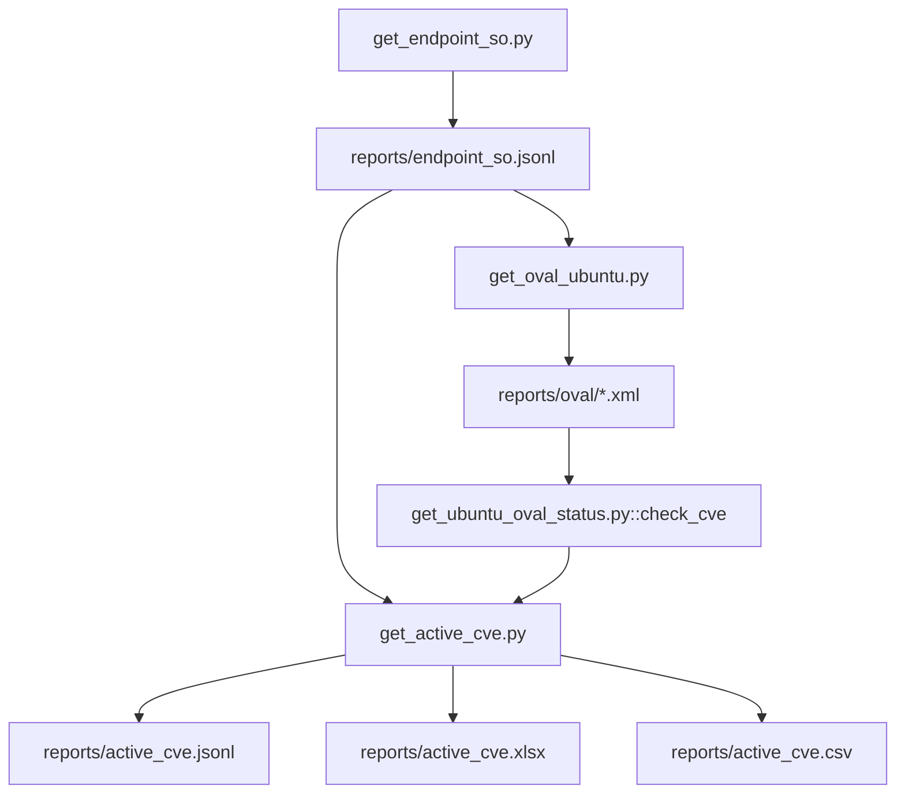

# `get_active_cve.py` — operação técnica completa

Guia consolidado do fluxo de geração de relatório de CVEs Ubuntu, incluindo dependências, entradas/saídas, parâmetros, estratégia de coleta e troubleshooting.

## Objetivo

`get_active_cve.py` é o script de entrega final. Ele consulta CVEs ativas no Vicarius, filtra endpoints Ubuntu, enriquece o status via OVAL/Ubuntu Security API e gera artefatos analíticos em `reports/`.

## Dependências externas (rede)

| Fonte externa | Endpoint/base | Consumida por | Finalidade |
| --- | --- | --- | --- |
| Vicarius API | `/vicarius-external-data-api/endpoint/search` | `get_endpoint_so.py` | Mapear `endpointId` -> `endpointName` |
| Vicarius API | `/vicarius-external-data-api/organizationEndpointPublisherOperatingSystems/search` | `get_endpoint_so.py` | Obter SO e versão por endpoint |
| Vicarius API | `/vicarius-external-data-api/aggregation/searchGroup` | `get_active_cve.py` | Coletar vulnerabilidades ativas |
| Canonical OVAL | `https://security-metadata.canonical.com/oval/` | `get_oval_ubuntu.py` | Baixar feeds `usn` e `cve` por release Ubuntu |
| Ubuntu Security API | `https://ubuntu.com/security/cves/{CVE}.json` | `get_ubuntu_oval_status.py` (fallback) | Resolver status quando CVE não está no OVAL local |

## Dependências de entrada

### Obrigatórios

- `.env` (mesmo diretório do script) com:
  - `VICARIUS_BASE_URL`
  - `VICARIUS_API_KEY`
- `reports/endpoint_so.jsonl` (gerado por `get_endpoint_so.py`)
- feeds OVAL locais em `reports/oval/` (gerados por `get_oval_ubuntu.py`)

### Dependências Python

- `requests`
- `urllib3`
- `openpyxl`
- biblioteca local: `get_ubuntu_oval_status.py` (`check_cve`)

## Ordem de execução recomendada

1. `python3 get_endpoint_so.py`
2. `python3 get_oval_ubuntu.py`
3. `python3 get_active_cve.py --force-update`

`get_ubuntu_oval_status.py` é usado internamente por `get_active_cve.py`.

## Saídas geradas

- `reports/active_cve.jsonl` (payload agregado por vulnerabilidade)
- `reports/active_cve.xlsx`
  - aba `Vulnerabilidades Ativas`
  - abas `Dashboard Ubuntu` e `Dashboard Tabelas`
- `reports/active_cve.csv` (export da aba principal)
- `reports/ubuntu_oval_cache.jsonl` (cache incremental das consultas OVAL/API)

## Leiaute dos artefatos

### `reports/endpoint_so.jsonl`

```json
{"endpoint":"srv-01","os":"Ubuntu","version":"24.04.4"}
```

### `reports/ubuntu_oval_cache.jsonl`

```json
{"key":"24.04.4|CVE-2024-0001|openssl|3.0.2","status":"Vulnerable"}
```

### Colunas de `reports/active_cve.xlsx` / `reports/active_cve.csv`

1. Ativo
2. SO
3. Versão do SO
4. Fornecedor do pacote
5. Pacote
6. Versão do Pacote
7. Descrição da Vulnerabilidade
8. CVE
9. Nível da Vulnerabilidade
10. Data da Criação
11. Data da Atualização
12. Status OVAL Ubuntu
13. KEV

## Estratégia de coleta

- `size` máximo por request: `500`
- paginação por SEEK:
  - mantém `from=0`
  - ordena por `aggregationId`
  - avança com `q=vulnerabilityId<ULTIMO_ID`
- retry para 429 e 5xx com backoff exponencial
- prioriza headers de espera de rate limit:
  1. `X-Rate-Limit-Retry-After-Seconds`
  2. `Retry-After`

## Parâmetros (scripts do fluxo)

| Script | Parâmetro | Default | Tipo |
| --- | --- | --- | --- |
| `get_active_cve.py` | `--force-update` | `false` | flag |
| `get_endpoint_so.py` | `--env` | `.env` | path |
| `get_endpoint_so.py` | `--output` | `reports/endpoint_so.jsonl` | path |
| `get_oval_ubuntu.py` | `--input` | `reports/endpoint_so.jsonl` | path |
| `get_oval_ubuntu.py` | `--output-dir` | `reports/oval` | path |
| `get_ubuntu_oval_status.py` | `--ubuntu` | — | str |
| `get_ubuntu_oval_status.py` | `--cve` | — | str |
| `get_ubuntu_oval_status.py` | `--pkg` | — | repetível `nome:versão` |

## Variáveis de ambiente relevantes

| Variável | Script | Default | Observação |
| --- | --- | --- | --- |
| `VICARIUS_BASE_URL` | `get_endpoint_so.py`, `get_active_cve.py` | — | obrigatória |
| `VICARIUS_API_KEY` | `get_endpoint_so.py`, `get_active_cve.py` | — | obrigatória |
| `VRX_REQUEST_DELAY` | `get_endpoint_so.py` | `1.05` | espaçamento entre requests |
| `VRX_MAX_RETRIES` | `get_endpoint_so.py` | `6` | retries HTTP/network |
| `VRX_BACKOFF_BASE` | `get_endpoint_so.py` | `2` | base do backoff |
| `VRX_PROGRESS_INTERVAL` | `get_endpoint_so.py` | `500` | intervalo de logs de progresso |
| `VRX_VULN_REQUEST_DELAY_SEC` | `get_active_cve.py` | `0` | delay entre páginas SEEK |

## Fluxo técnico



## Uso rápido

```shell
python3 get_active_cve.py
```

Para forçar regeneração sem reutilizar arquivos locais:

```shell
python3 get_active_cve.py --force-update
```

Exemplo de validação pontual do resolvedor OVAL/API:

```shell
python3 get_ubuntu_oval_status.py --ubuntu 24.04 --cve CVE-2024-0001 --pkg openssl:3.0.2
```

## Troubleshooting rápido

- **Erro de credencial ausente**: valide `.env` no mesmo diretório do script.
- **Status OVAL em branco/inconsistente**: atualize feeds com `get_oval_ubuntu.py`.
- **Muitas CVEs/tempo de execução alto**: esperado; o processo inclui enriquecimento por pacote e cache progressivo.
